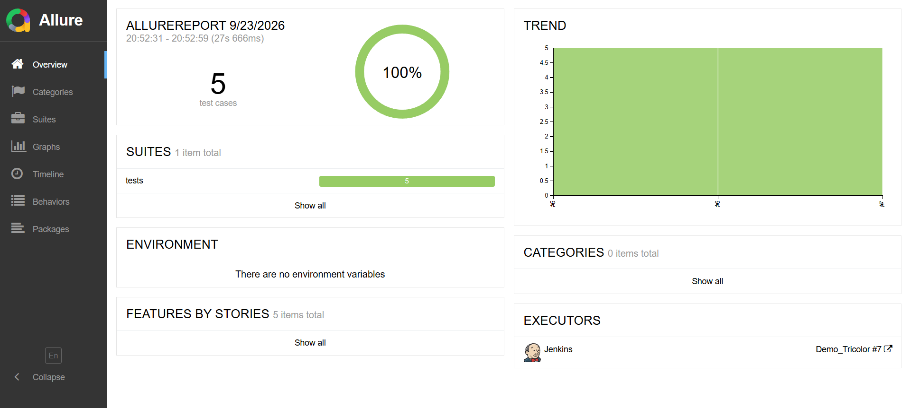
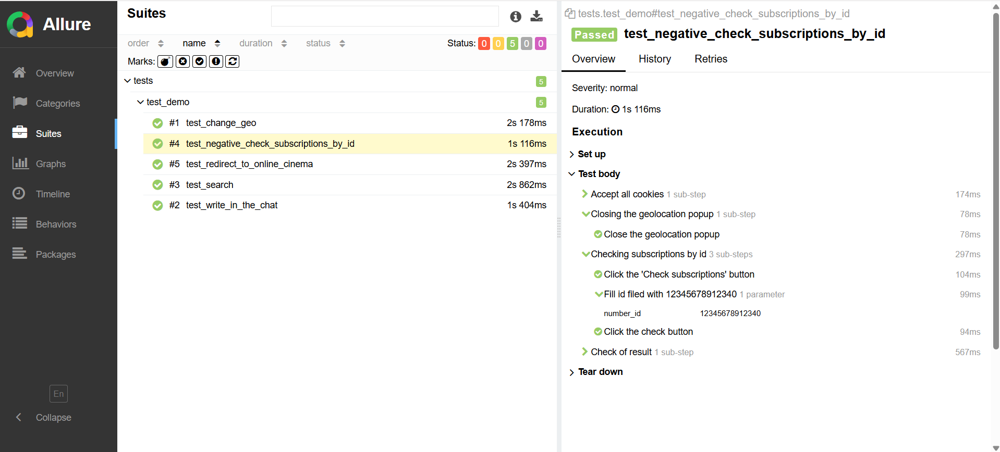
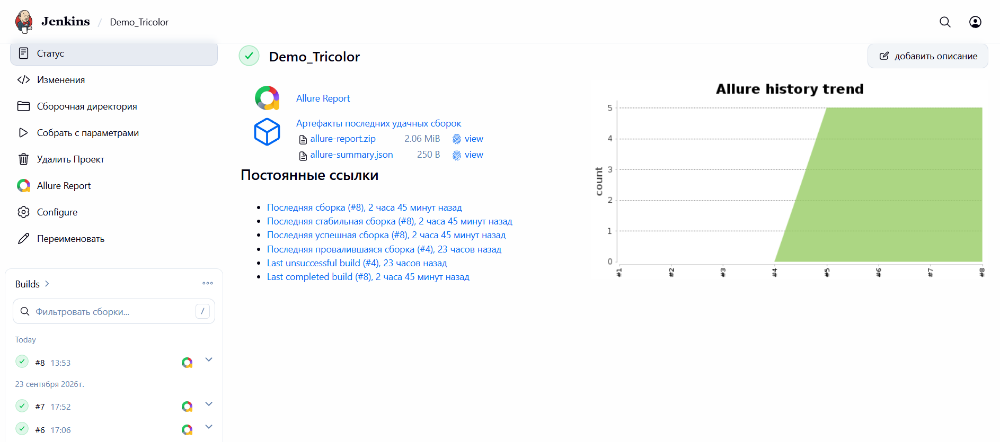
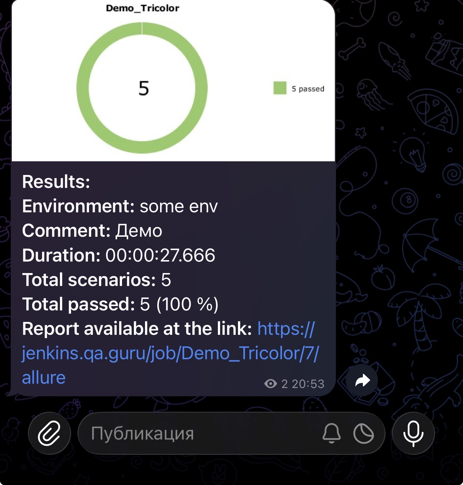

# Tricolor UI Test Automation

Демонстрационный проект с UI-автотестами для сайта [Триколор](https://www.tricolor.ru/).

Проект демонстрирует автоматизацию пользовательских сценариев веб-приложения: запуск тестов, формирование Allure-отчётов
и выполнение браузерных тестов в удалённой среде Selenoid.

## Используемый стек

<p align="center">
  
  &nbsp;&nbsp;
  
  &nbsp;&nbsp;
  
  &nbsp;&nbsp;
  
  &nbsp;&nbsp;
  
  &nbsp;&nbsp;
  
</p>

- **Python** — язык программирования, на котором написаны автотесты.
- **Selenium WebDriver** — библиотека для управления браузером и взаимодействия с элементами веб-страницы.
- **Pytest** — фреймворк для организации, запуска и параметризации тестов.
- **Allure Report** — инструмент для формирования интерактивных отчётов о результатах тестирования.
- **Jenkins** — сервер непрерывной интеграции для автоматического запуска тестов и публикации результатов.
- **Selenoid** — сервис для запуска удалённых браузерных сессий в Docker-контейнерах.

## Что тестируется

Автоматизированы пользовательские сценарии:

- Выбор геопозиции при первом посещении сайта.
- Отправка сообщения в чат поддержки.
- Поиск по сайту.
- Переход в онлайн-кинотеатр.
- Проверка подписок по Триколор-id.

## Структура проекта

```text
TricolorPA/
├── assets/
│   └── gif/                    # Гифки
│   └── icons/                  # Иконки технологий для README
│   └── images/                 # Скриншоты
│
├── pages/                      # Page Object
│   └── base_page.py            # Базовый класс для всех страниц
│   └── demo_page.py            # Страница демонстрации тестов
│
├── tests/                      # Автотесты
│   └── test_demo.py            # Тесты для страницы демонстрации
│
├── utils/                      # Вспомогательные утилиты и хелперы
│   └── attach.py               # Модуль для добавления вложений
│
├── conftest.py                 # Фикстуры Pytest и настройка браузера с подключением к Selenoid
├── pytest.ini                  # Конфигурация Pytest
├── requirements.txt            # Зависимости проекта
└── README.md                   # Документация проекта
```

## Локальный запуск

1. Клонируйте репозиторий:

```bash
git clone [https://github.com/corvuscorvx/TricolorPA.git](https://github.com/corvuscorvx/TricolorPA.git)
cd TricolorPA
```

2. Откройте проект в PyCharm.

3. Создайте виртуальное окружение `.venv` на базе Python 3.14.

4. В терминале PyCharm активируйте окружение и установите зависимости:

```bash
.venv\Scripts\Activate
pip install -r requirements.txt
```

## Локальный запуск тестов

Перед запуском убедитесь, что виртуальное окружение `.venv` активировано и вы находитесь в корневой папке проекта.

### Запуск всех UI-тестов:

```bash
pytest -v tests/test_demo.py
```

- `pytest` — запускает тестовый фреймворк Pytest.
- `-v` (`verbose`) — выводит название и статус каждого теста.
- `tests/test_demo.py` — путь к файлу с UI-автотестами.

### Запуск одного теста:

Чтобы запустить один тест из файла, после пути к файлу укажите его имя через `::`:

```bash
pytest -v tests/test_demo.py::<имя_теста>
```

### Запуск с увеличенной детализацией:

```bash
pytest -vv tests/test_demo.py
```

Ключ `-vv` увеличивает подробность вывода Pytest по сравнению с `-v`.

При падении теста команда может показать более полный diff значений в проверках `assert` и меньше сокращать длинные
сообщения об ошибках.

## Формирование Allure-отчёта

Настройки формирования результатов Allure определены в файле `pytest.ini`:

```ini
[pytest]
addopts = --clean-alluredir --alluredir=allure-results
```

Поэтому для запуска UI-тестов и одновременного сохранения результатов Allure достаточно выполнить команду:

```bash
pytest -v tests/test_demo.py
```

После завершения тестового прогона результаты будут сохранены в папке `allure-results`.

Для формирования и открытия отчёта выполните:

```bash
allure serve allure-results
```

Команда создаёт временный HTML-отчёт на основе данных из `allure-results` и автоматически открывает его в браузере.

### Отчет Allure





> Для работы команды `allure serve` на компьютере должны быть установлены Java и Allure Report Engine.

## Запуск в Jenkins

Проект интегрирован с Jenkins для автоматического запуска UI-тестов.

Во время сборки Jenkins получает код из репозитория, устанавливает зависимости, запускает Pytest и формирует результаты
для Allure Report. Браузерные сессии создаются в удалённой среде Selenoid.

> Jenkins и Selenoid развёрнуты в личной тестовой инфраструктуре. Параметры подключения к Selenoid и конфиденциальные
> данные хранятся в переменных окружения и не публикуются в репозитории.

### Сборка в Jenkins



## Уведомления в Telegram

После завершения Jenkins-сборки Telegram-бот отправляет уведомление с результатом выполнения UI-тестов.

Уведомление содержит статус сборки, краткую информацию о тестовом прогоне и ссылку на Allure-отчёт.

> Токен Telegram-бота, идентификатор чата и другие конфиденциальные параметры хранятся в переменных окружения и не
> публикуются в репозитории.

### Уведомление от бота



### Демонстрация UI-теста

